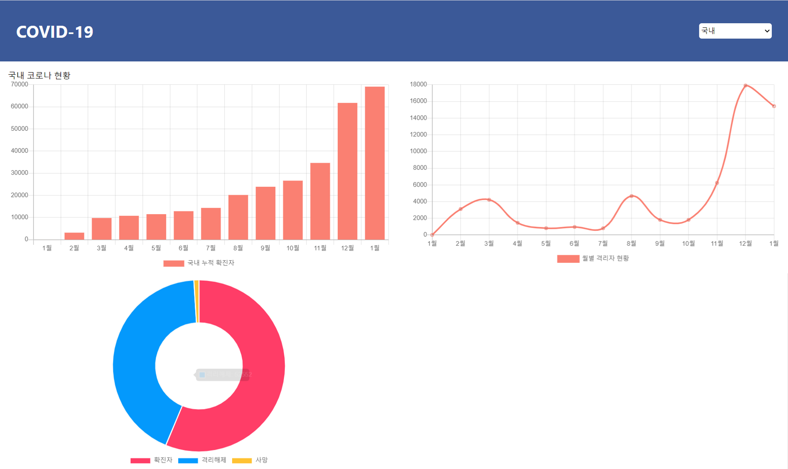

### COVID-19 집계 사이트

<a href='https://www.youtube.com/watch?v=DtLhiMxgsm0&feature=youtu.be'>강의 영상 </a>

#### 완성 페이지

 
 

### 강의 내용

* 사용 api : https://api.covid19api.com/total/dayone/country/kr
* $ npm create-react-app covid (covid react project 생성)
* ES7 snippet extension을 설치해서 편리하게 사용
>파일생성 후 rafce 단축어를 입력하면 자동으로 react 기본 코드가 제공됨
* $ npm install axios react-chartjs-2 (axios와 차트표현을 위한 react-chartjs-2를 install)
* $ npm install chart.js

#### 구조
* 한페이지에 헤더와 그래프들이 들어간다
* Header와 Contents(그래프들)로 component를 나눈다

#### 코드
* App.css
    * display: flex -> header와 body로 나뉠것 이므로
    * flex-direction: column -> 세로로 정렬되도록
    * justify-content: space-between -> COVID-19와 select가 양 옆으로 붙도록

* useEffect : mount가 되었을 때 method를 실행하도록
    * 로딩전(차트가 표시되기 전)api에서 data를 받아오는 함수를 넣어둔다
    * data를 받아 필요한 정보만 처리하는 makeData함수도 실행되도록 한다(reduce 구문 사용)

* useState : state를 관리하는
    * [Data명, setting_method(보통 setData명 으로 이름 설정)] = useState(초기값)
    * 현재 Contents.js의 confirmedData는 object 형태이다(labels과 datasets가 존재)